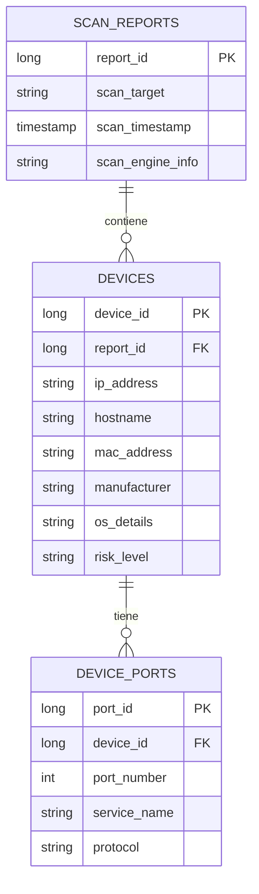

# **🌐 NetScan - Escáner de Red Avanzado**

*"Tu herramienta todo-en-uno para el reconocimiento de red"*


## **📌 Tabla de Contenidos**

1. [Características](#-características)
2. [Capturas de Pantalla](#-capturas-de-pantalla)
3. [Instalación](#-instalación)
4. [Uso](#-uso)
5. [Estructura del Proyecto](#-estructura-del-proyecto)
6. [Esquema de la Base de Datos](#-esquema-de-la-base-de-datos)
7. [Contribuir](#-contribuir)
8. [Licencia](#-licencia)

---

## **✨ Características**

✔ **Descubrimiento de Red**

* Detección automática de la red local (notación CIDR)
* Escaneo de rangos IP personalizados

✔ **Escaneo de Puertos**

* Integración con Nmap con parámetros personalizables
* Detección de puertos abiertos con identificación de servicios

✔ **Análisis de Seguridad**

* Evaluación de riesgo (Bajo/Medio/Alto)
* Indicadores de vulnerabilidad para servicios comunes

✔ **Gestión de Datos**

* Almacenamiento en base de datos SQLite (3 tablas relacionales)
* Exportación a formatos JSON/CSV/HTML

✔ **Interfaz de Usuario**

* Panel moderno en JavaFX
* Seguimiento en tiempo real del progreso
* Detalles interactivos de los dispositivos

---

## **🛠 Instalación**

### **Requisitos Previos**

* Java 17+ ([Descargar](https://adoptium.net/))
* Nmap instalado ([Windows](https://nmap.org/download.html) | Linux: `sudo apt install nmap`)

### **Configuración**

1. Clona el repositorio:

   ```bash
   git clone https://github.com/HiImGhost666/netscan-main
   cd netscan-main
   ```

2. Compila con Maven:

   ```bash
   mvn clean package
   ```

3. Ejecuta la aplicación:

   ```bash
   java -jar target/netscan.jar
   ```

---

## **🚀 Uso**

### **Escaneo Básico**

1. Selecciona una red desde el menú desplegable
2. Haz clic en "Iniciar Escaneo"
3. Visualiza los resultados en las tablas interactivas

### **Opciones Avanzadas**

* **Objetivos Personalizados**: Introduce rangos IP manualmente _**(Proximamente)**_
* **Exportar Resultados**: Genera informes en varios formatos `HTML/CSV/JSON`
* **Acceso a la Base de Datos**: Consulta datos históricos de escaneos

### **Ejemplo de Uso**

```java
Te saldrá un menú desplegable con las redes locales. 
Selecciona una red y haz clic en "Iniciar Escaneo".
```

---

## **📁 Estructura del Proyecto**

```
netscan/
├── src/
│   ├── main/
│   │   ├── java/
│   │   │   └── com/miproyectored/
│   │   │       ├── controller/      # Controladores de UI
│   │   │       ├── model/           # Modelos de datos
│   │   │       ├── scanner/         # Integración con Nmap
│   │   │       ├── inventory/       # Gestor de base de datos
│   │   │       ├── util/            # Utilidades
│   │   │       └── export/          # Exportadores de reportes
│   │   └── resources/
│   │       ├── css/                 # Hojas de estilo
│   │       ├── images/              # Imágenes de la aplicación
│   │       └── fxml/                # Diseños de interfaz
│   └── test/                        # Pruebas unitarias
├── reports/                         # Reportes generados
├── network_inventory.db             # Base de datos SQLite
└── pom.xml                          # Configuración Maven
```

---

## **🗃 Esquema de la Base de Datos**



---

## **📜 Licencia**

Distribuido bajo la Licencia MIT. Consulta el archivo `LICENSE` para más información.

---


